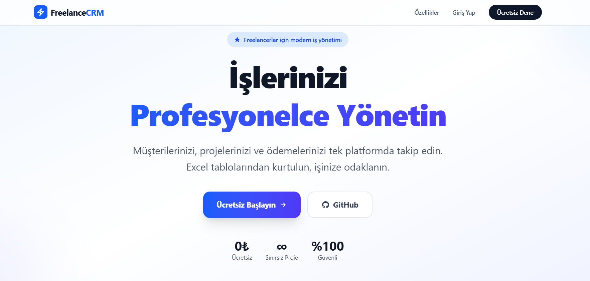
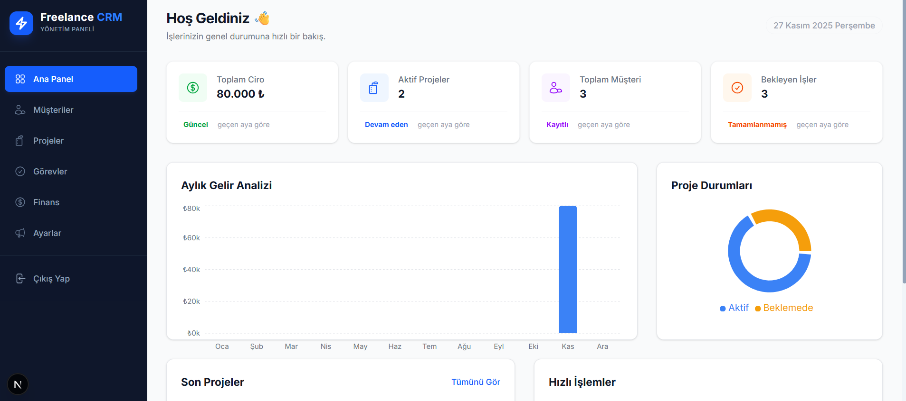
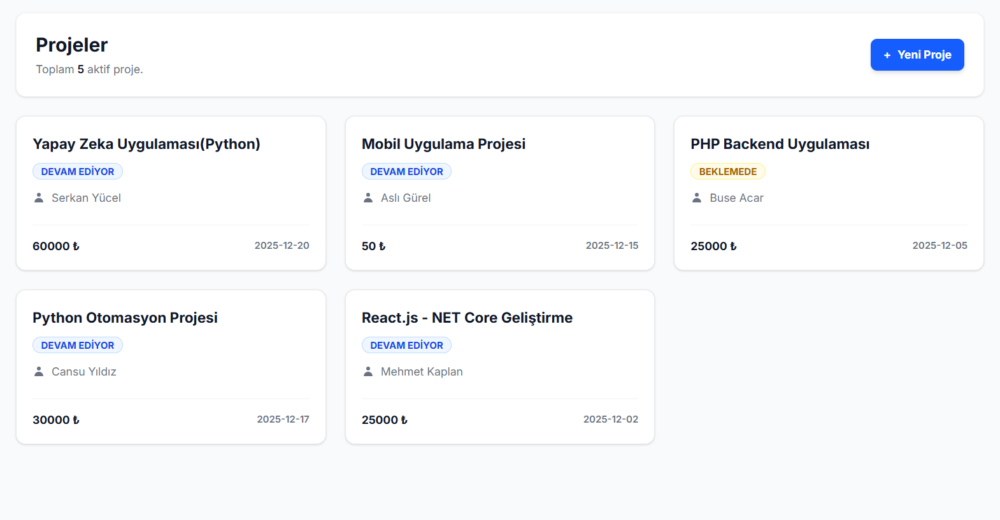
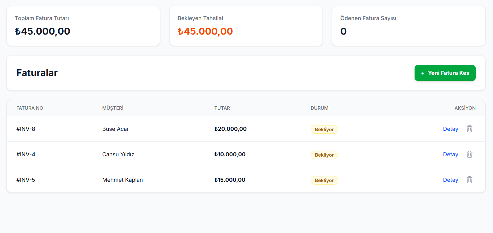
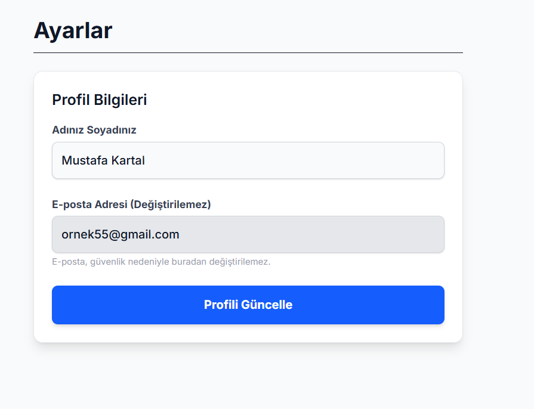

# 🚀 Freelance CRM

Freelance CRM, bağımsız çalışanların ve küçük işletmelerin iş akışlarını düzene sokmak için geliştirdiğim, modern ve kapsamlı bir yönetim panelidir.

Müşteri takibinden proje yönetimine, görev listelerinden finansal kayıtlara kadar her şeyi tek bir ekranda toplayarak Excel tabloları arasında kaybolmanızı engeller. **Next.js 16** ve **Supabase** mimarisi üzerine kurulan bu proje, performans ve veri güvenliğini en üst düzeyde tutar.

🔗 **Canlı Demo:** https://taskpilotcrm.vercel.app



---

## ✨ Neler Yapabilirsiniz?

Sıradan bir veri giriş uygulamasının ötesinde, işinizi gerçekten yönetmenizi sağlayan özellikler:

- **📊 Canlı Dashboard:** Aylık geliriniz ve proje durumlarınız anlık olarak hesaplanır ve interaktif grafiklerle (Recharts) sunulur.
- **🛡️ Üst Düzey Güvenlik:** Her kullanıcının verisi **Row Level Security (RLS)** ile veritabanı seviyesinde izole edilmiştir. Kimse başkasının verisini göremez.
- **📱 Her Yerde Sizinle:** Mobil öncelikli (Mobile-First) tasarım sayesinde telefonunuzdan da bilgisayarınızdan da aynı konforla çalışırsınız.
- **✅ Akıllı Görev Yönetimi:** Projelerinize özel görevler ekleyin, tek tıkla tamamlayın ve ilerlemenizi takip edin.
- **💰 Finansal Takip:** Faturalarınızı kesin, bekleyen ödemelerinizi görün ve toplam cironuzu analiz edin.
- **⚡ Modern Altyapı:** API karmaşası olmadan, **Server Actions** ile doğrudan ve hızlı veri yönetimi.

---

## 🛠️ Kullandığım Teknolojiler

Proje, endüstri standardı en güncel teknolojilerle inşa edildi:

- **Framework:** [Next.js 16](https://nextjs.org/) (App Router & Server Components)
- **Dil:** [TypeScript](https://www.typescriptlang.org/) (Tip güvenliği için)
- **Veritabanı & Auth:** [Supabase](https://supabase.com/) (PostgreSQL)
- **Stil:** [Tailwind CSS](https://tailwindcss.com/) (v4 Standartları)
- **Grafik:** [Recharts](https://recharts.org/)
- **Paket Yöneticisi:** pnpm

---

## 📸 Uygulama Görüntüleri

|                 Yönetim Paneli                 |               Projeler               |
| :--------------------------------------------: | :----------------------------------: |
|  |  |

|          Finans Takibi           |          Ayarlar & Mobil           |
| :------------------------------: | :--------------------------------: |
|  |  |

---

## 🚀 Kurulum ve Çalıştırma

Projeyi kendi bilgisayarınızda çalıştırmak için şu adımları izleyin:

**1. Projeyi Klonlayın**

```bash
git clone [https://github.com/anilakbay/freelance-crm.git](https://github.com/anilakbay/freelance-crm.git)
cd freelance-crm
```
