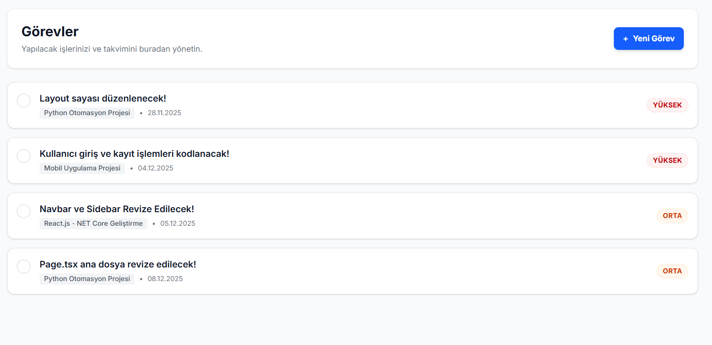
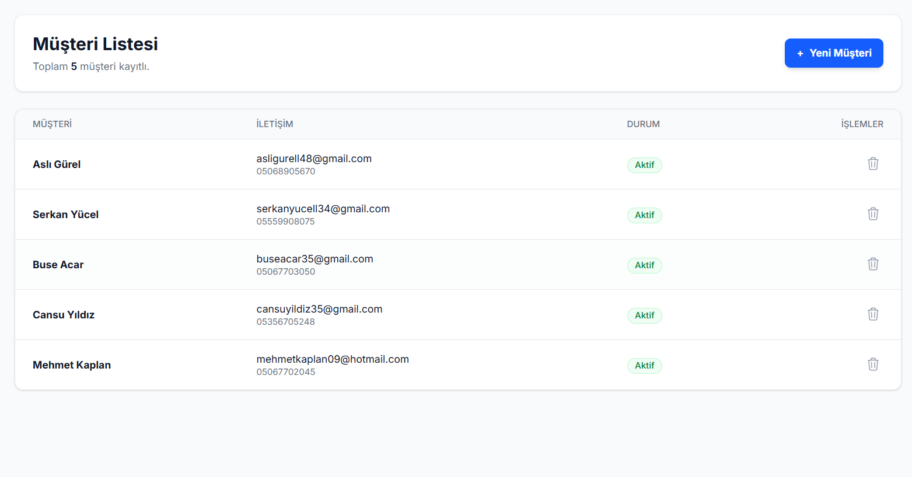
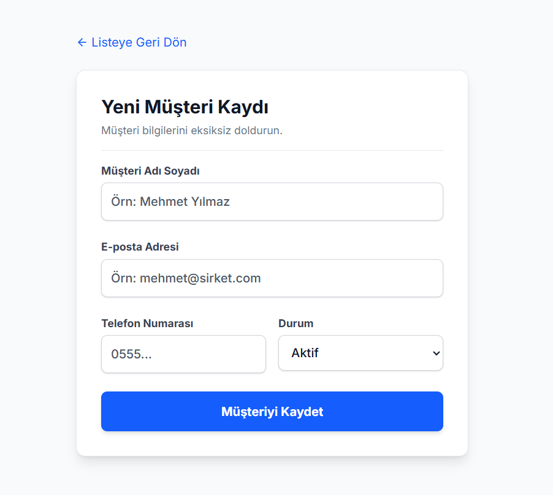

# TaskPilot CRM


> **Freelancer olarak işlerinizi düzenlemek, projelerinizi ve görevlerinizi tek bir yerden yönetmek artık çok kolay. TaskPilot CRM ile finanslarınızı, projelerinizi ve günlük iş akışınızı hızlı ve pratik bir şekilde kontrol edebilirsiniz.**

### 🚀 [Canlı Demo (Live)](https://taskpilotcrm.vercel.app/)

---

## 📸 Proje Görselleri

|             **Ana Sayfa**             |       **Yönetim Paneli (Dashboard)**        |
| :-----------------------------------: | :-----------------------------------------: |
|  |  |

|             **Projeler**             |          **Görev Yönetimi**          |
| :----------------------------------: | :----------------------------------: |
|  |  |

|           **Müşteri Listesi**            |            **Yeni Müşteri Kaydı**             |
| :--------------------------------------: | :-------------------------------------------: |
|  |  |

|      **Finans & Faturalar**      |            **Ayarlar**             |
| :------------------------------: | :--------------------------------: |
|  |  |

---

## ✨ Özellikler

- **📊 Dashboard:** Gelir grafikleri, aktif işler ve özet istatistikler.
- **👥 Müşteri Yönetimi:** Detaylı profil, iletişim bilgileri ve geçmiş kayıtlar.
- **📁 Proje Takibi:** Görsel kartlar, durum yönetimi ve deadline takibi.
- **✅ Görevler:** Önceliklendirilmiş yapılacaklar listesi.
- **💰 Finans:** Fatura kesme, tahsilat takibi ve raporlama.

---

## 🛠️ Kurulum

```bash
# 1️⃣ Projeyi Klonla
git clone https://github.com/anilakbay/freelance-crm.git
cd freelance-crm

# 2️⃣ Paketleri Yükle
pnpm install

# 3️⃣ Env Dosyasını Oluştur (.env.local)
NEXT_PUBLIC_SUPABASE_URL=your_project_url
NEXT_PUBLIC_SUPABASE_ANON_KEY=your_anon_key

# 4️⃣ Uygulamayı Başlat
pnpm dev

-- Clients (Müşteriler)
CREATE TABLE clients (
  id BIGSERIAL PRIMARY KEY,
  user_id UUID NOT NULL REFERENCES auth.users(id) ON DELETE CASCADE,
  name TEXT NOT NULL,
  email TEXT,
  phone TEXT,
  company TEXT,
  status TEXT NOT NULL DEFAULT 'active',
  created_at TIMESTAMPTZ DEFAULT NOW()
);

-- Projects (Projeler)
CREATE TABLE projects (
  id BIGSERIAL PRIMARY KEY,
  user_id UUID NOT NULL REFERENCES auth.users(id) ON DELETE CASCADE,
  client_id BIGINT NOT NULL REFERENCES clients(id) ON DELETE CASCADE,
  title TEXT NOT NULL,
  price NUMERIC(10,2),
  deadline DATE,
  status TEXT NOT NULL DEFAULT 'active',
  created_at TIMESTAMPTZ DEFAULT NOW()
);

-- Tasks (Görevler)
CREATE TABLE tasks (
  id BIGSERIAL PRIMARY KEY,
  user_id UUID NOT NULL REFERENCES auth.users(id) ON DELETE CASCADE,
  project_id BIGINT NOT NULL REFERENCES projects(id) ON DELETE CASCADE,
  title TEXT NOT NULL,
  status TEXT NOT NULL DEFAULT 'pending',
  priority TEXT NOT NULL DEFAULT 'medium',
  due_date DATE,
  created_at TIMESTAMPTZ DEFAULT NOW()
);

-- Invoices (Faturalar)
CREATE TABLE invoices (
  id BIGSERIAL PRIMARY KEY,
  user_id UUID NOT NULL REFERENCES auth.users(id) ON DELETE CASCADE,
  client_id BIGINT NOT NULL REFERENCES clients(id) ON DELETE CASCADE,
  invoice_date DATE NOT NULL,
  due_date DATE NOT NULL,
  amount NUMERIC(10,2) NOT NULL,
  status TEXT NOT NULL DEFAULT 'pending',
  description TEXT,
  created_at TIMESTAMPTZ DEFAULT NOW()
);

-- RLS Güvenlik Ayarları
ALTER TABLE clients ENABLE ROW LEVEL SECURITY;
ALTER TABLE projects ENABLE ROW LEVEL SECURITY;
ALTER TABLE tasks ENABLE ROW LEVEL SECURITY;
ALTER TABLE invoices ENABLE ROW LEVEL SECURITY;

CREATE POLICY "users_own_data" ON clients FOR ALL USING (auth.uid() = user_id);
CREATE POLICY "users_own_data" ON projects FOR ALL USING (auth.uid() = user_id);
CREATE POLICY "users_own_data" ON tasks FOR ALL USING (auth.uid() = user_id);
CREATE POLICY "users_own_data" ON invoices FOR ALL USING (auth.uid() = user_id);

🚀 Deploy (Canlıya Alma)

GitHub’a pushlayın.

Vercel üzerinde yeni proje oluşturun.

.env değişkenlerini girin ve deploy edin.
```
